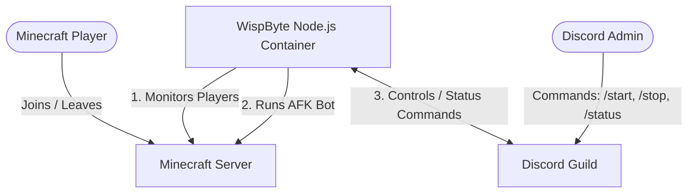

# 🚀 Hosting DiscoMine on WispByte: Step-by-Step Guide

Welcome! This guide provides a complete, easy-to-follow, step-by-step walkthrough to get your **DiscoMine** bot running perfectly and 24/7 on **WispByte**.

---

## 🗺️ How It Works

Here is a visual map of how the components communicate:

---

## 🛠️ Step 1: Create and Configure Your Discord Bot

Before setting up anything on WispByte, you need to create a Discord application and get its credentials.

1. **Go to the Discord Developer Portal**: Open the [Discord Developer Portal](https://discord.com/developers/applications) and sign in.
2. **Create Application**: Click **New Application** in the top right, name your bot (e.g., `DiscoMine`), and click **Create**.
3. **Get Application ID (Client ID)**:
   - On the **General Information** page, find the **Application ID**.
   - Copy this ID. This is your `CLIENT_ID`.
4. **Get Bot Token**:
   - Go to the **Bot** tab on the left sidebar.
   - Click **Reset Token** and copy the new token. Save it securely! This is your `DISCORD_TOKEN`.
5. **Enable Gateway Intents** (⚠️ *CRITICAL*):
   - Scroll down on the **Bot** tab to the **Privileged Gateway Intents** section.
   - **Enable** the following intents:
     * `Presence Intent`
     * `Server Members Intent`
     * `Message Content Intent`
   - Click **Save Changes**.
6. **Generate Invite Link**:
   - Go to the **OAuth2** tab, then select the **URL Generator** sub-tab.
   - Under **Scopes**, select `bot` and `applications.commands`.
   - Under **Bot Permissions**, select:
     * `Send Messages`
     * `Use Slash Commands`
     * `Embed Links`
     * `Read Message History`
   - Copy the generated URL at the bottom and open it in a new browser tab to invite the bot to your Discord Server.

---

## 🔑 Step 2: Retrieve Your Discord Guild & Channel IDs

You need two specific IDs from your Discord server:

1. **Enable Developer Mode in Discord**:
   - Open your Discord App. Go to **User Settings** (cog icon) → **Advanced**.
   - Toggle **Developer Mode** to **ON**.
2. **Get Server ID (Guild ID)**:
   - Right-click your server's icon on the left server list and click **Copy Server ID**. This is your `GUILD_ID`.
3. **Get Status Channel ID** *(Optional but recommended)*:
   - Create or pick a text channel where you want the bot to post live connection/disconnection logs.
   - Right-click the channel name and select **Copy Channel ID**. This is your `STATUS_CHANNEL_ID`.

---

## ☁️ Step 3: Set Up a Server on WispByte

**WispByte** offers free Node.js hosting, which is perfect for this bot.

1. **Sign Up / Log In**: Visit [wispbyte.com](https://wispbyte.com) and access the [Client Panel](https://wispbyte.com/client).
2. **Create a Server**:
   - Click **Create Server** (or go to the server deployment page).
   - Enter a name (e.g., `DiscoMine`).
   - Select the **Node.js** Docker Egg/Image.
   - Choose the **Free Plan** (no credit card required).
3. **Wait for Provisioning**: Once created, wait a minute or two for the status to change to **Active**.

---

## 📤 Step 4: Upload Bot Files to WispByte

1. **Access the Server Control Panel**: Click on your server in the WispByte list to open the server management dashboard.
2. **Go to the File Manager**: Click **Files** (or File Manager) on the left sidebar.
3. **Upload the Files**:
   - Upload the following files from your local project folder:
     * 📁 `index.js`
     * 📁 `minecraft.js`
     * 📁 `config.js`
     * 📁 `package.json`

> [!WARNING]
> **DO NOT** upload the `node_modules` folder or the local `.env` file. 
> - WispByte will automatically download your dependencies from `package.json`.
> - The environment variables will be set securely in the next step.

---

## ⚙️ Step 5: Configure Environment Variables on WispByte

We configure the bot using WispByte's secure environment settings rather than a `.env` file.

1. **Navigate to Settings / Startup**:
   - In your WispByte server console dashboard, look for the **Startup** tab (or **Environment Variables** / **Settings** tab).
2. **Enter the Variables**: Add or edit variables with the following keys and values:

| Variable Name | Description | Example Value |
| :--- | :--- | :--- |
| `DISCORD_TOKEN` | The bot token copied in Step 1. | `MTI...` |
| `CLIENT_ID` | The Application ID from Step 1. | `123456789012345678` |
| `GUILD_ID` | Your Discord Server ID from Step 2. | `987654321098765432` |
| `MC_SERVER_IP` | Your Minecraft Server address. | `myawesomeserver.falixsrv.me` |
| `MC_SERVER_PORT` | Minecraft server port (Default is `25565`). | `25565` |
| `MC_USERNAME` | The username the AFK bot will display in Minecraft. | `DiscoMineAFK` |
| `MC_AUTH` | Authentication mode (`offline` for cracked, `microsoft` for premium). | `offline` |
| `STATUS_CHANNEL_ID` | *(Optional)* Discord channel ID for status updates. | `112233445566778899` |

3. **Verify Start Command**:
   - Look at the **Start Command** or **Startup Command** setting.
   - It should be set to: `node index.js` (or `npm start`).

---

## 🚀 Step 6: Start and Run

1. Go back to the **Console** tab of your WispByte dashboard.
2. Click **Start**.
3. You will see:
   - WispByte automatically installing dependencies (running `npm install`).
   - The output log: `[Discord] logged in as ...`
   - The output log: `[Discord] slash commands registered!`
   - The output log: `[Bot] starting bot...`

Your bot is now alive and running 24/7!

---

## 🎮 Discord Command Reference

Once the bot starts, the following slash commands will become available in your Discord server:

* `/start` — Manually triggers the bot to connect to the Minecraft server. It will automatically check player counts, sit AFK if empty, and disconnect/sleep if someone joins.
* `/stop` — Stops the bot and forces it to disconnect from the Minecraft server.
* `/status` — Displays a beautiful embed showing the current connection state of the bot, player count, current uptime, and reconnect count.

---

## 🛠️ Troubleshooting & Support

### ❌ The Bot isn't registering Slash Commands
- **Solution**: Make sure you enabled the `applications.commands` scope when generating your invite link. If you didn't, kick the bot from your server, regenerate the invite link with both `bot` and `applications.commands` checked, and invite it again.

### ❌ Bot fails to connect to Minecraft (ECONNREFUSED / Timeout)
- **Solution**: Double-check your `MC_SERVER_IP` and `MC_SERVER_PORT` in WispByte's environment variables. Note that if your Minecraft server is fully sleeping, the bot's first join attempt might time out; however, the bot has built-in auto-reconnection and will successfully join once the server boots up.

### ❌ Error: "Disallowed Intents" on startup
- **Solution**: Go back to the [Discord Developer Portal](https://discord.com/developers/applications), select your application, navigate to **Bot**, and make sure the three checkboxes under **Privileged Gateway Intents** are enabled.
